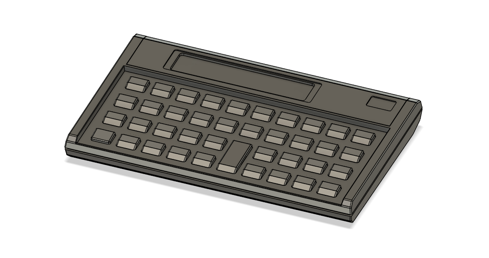
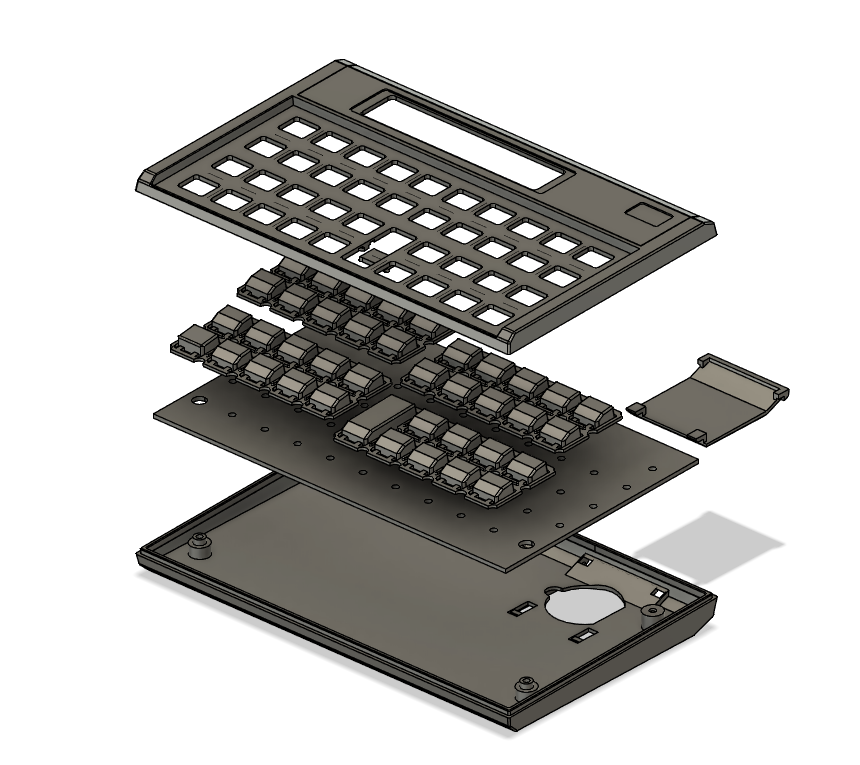
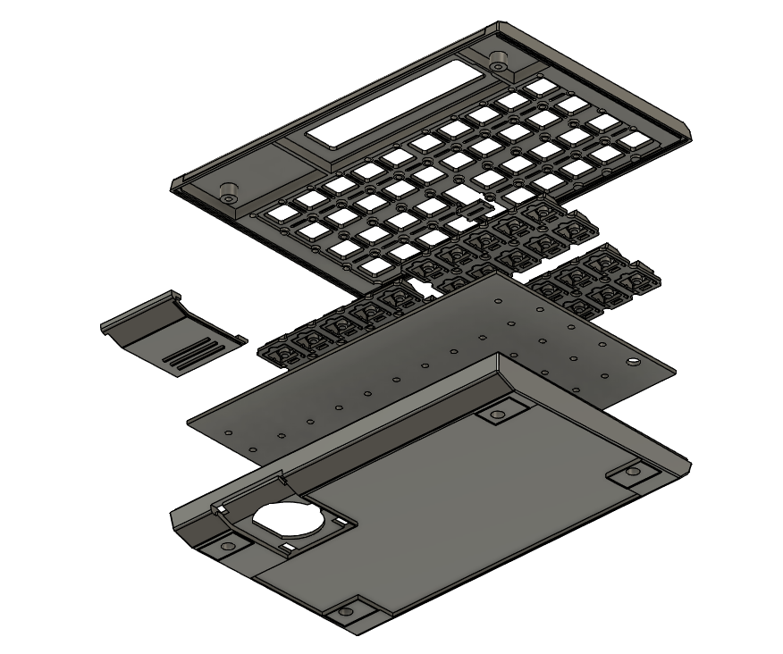

# 3D printable handheld computer shell 
File: [https://numpad0.com/calculatorshell/calculatorshell.step](https://numpad0.com/calculatorshell/calculatorshell.step)

## Description
This is printable design data for a lookalike HP "Voyager" style handheld computer. File includes cutout for PCB, provisions for metal switch domes(5mm IIRC), and spaces for a cheap non-backlit 16x2 LCD glass, coin cells, and enough space for driver board for the glass as well as a Raspberry Pi Pico. Circuit designs are not included. The file does not include logo and/or labeling designs.
All mechanical parts are intended to be printed on a home resin type SLA 3D printer. It would not be practical to print on a FDM filament printers. 

  

It was *meant* to be a personal handheld UART terminal with calculation features.

## LICENSE
CC BY-SA. Note that this is made to be visually identical to an HP product, so common sense applies despite including none of original logo or text. If anyone's making a commercial product based on this data, I won't be involved in that and I won't take any resposibilities. 

## COPYRIGHT  
(C) 2025 @numpad0 
