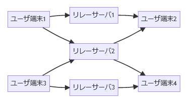

# クラッシュコースNostr
## 2023/02/07

## Nostrってなに
　新しいTwitterクローン(2).web3。仮想通貨機能(Lightning Networkによる簡易送金)が初めから統合されている。ブロックチェーンではない。P2Pではない。リレー間のメッシュ機能はまだない。アーキテクチャはWinny掲示板に似ているらしい。IDは独自形式の公開鍵ペアで、投稿は秘密鍵で署名され、 **リレーサーバ**に送信される。ユーザは推しがいる**リレーサーバ**に接続してフォローしておくと、投稿が降ってくる。手動更新ではなくストリーミングAPI的な挙動になる。
 
 <div align="center">
    
</div>

## はじめかた
　クライアントアプリ(iOS: [Damus](https://apps.apple.com/jp/app/damus/id1628663131), Android: [Amethyst](https://play.google.com/store/apps/details?id=com.vitorpamplona.amethyst), PC: [iris.to](https://iris.to))を開いて希望の@ユーザ名を打ち込むと秒でIDができる。よく使われるリレーのURLは最初からアプリに登録されている。ID取得はローカルの生成動作なので何の待ちもチェックもない。この時**公開鍵**と**秘密鍵**が生成され、これが**ID**と**パスワード**に相当する。公開鍵は`npub`、秘密鍵は`nsec`で始まる。逆に文字形式のパスワードはない。秘密鍵は絶対になくしてはいけない。Twitter互換の@ユーザ名とディスプレイネームは存在するが@ユーザ名の一意性は強制されないので好きに被らせられる。

## 公開鍵暗号
　平文に対して公開鍵と秘密鍵の両方で1回ずつ暗号化すると平文に戻る暗号化方式。どちらを先に行ってもよく、平文を秘密鍵で暗号化すれば公開鍵で復号できるし、公開鍵で暗号化すると秘密鍵で復号できる。片方だけ行ったものを暗号文として扱う。ただし、同じ鍵で復号することはできない。もう片割れで処理する以外に解読方法はない。

## 秘密鍵の取り扱い
　**秘密鍵は絶対になくしてはいけない**。なくすとログインできなくなる。また、パスワードなので他人に教えてはいけないし、信頼できないアプリに打ち込んでもいけない。現状、変更や再発行や失効や継承ができないので、秘密鍵を流出または紛失した場合は**転生することになる**。ただし、認証バッジを剥がして付け替えることはできる。なくさないように鍵はスクショしてとっておくのがいいと筆者は考えている。

## 投稿の呼び方
　"note"。頭は大文字なのか? わからない。

## ログイン
　秘密鍵を打ち込むとログインできる。べきところに公開鍵を打ち込むとネトストできる(?)。Twitter古参の言い方で言えばxAuthかつパスワード変更不可なので**秘密鍵は絶対になくしてはいけない**。iris.toには入力していいのか? 何も分からない。筆者は雰囲気でNostrをやっている。

## リレーサーバ
 noteを受け付けて保持してくれるお人好しが運営している掲示板サーバ。運営するインセンティブとしては投げ銭をもらうとかソーシャルグラフの観測に役立てることが考えられる。クライアントアプリは投稿すると一斉に登録全リレーへ同報するようになっており、逆に待っているとリレーからはフォローしている公開鍵の付いたnoteが降ってくる。メンションは同じリレーサーバを共有している相手同士でしか見えない。

## スパム
　現在、Globalタイムラインに大量の中国語エロ動画や仮想通貨系スパムが流れている。対策はない。リレーサーバを全部外してスパム対策済みのサーバに切り替えると止まると思われるが、そのスパム対策済みサーバに接続しているユーザとしか会話できなくなるので筆者はおすすめしない。

## フォロワーへのID共有方法
　クライアントアプリのプロフィール画面に公開鍵が見えているので、それをコピペするのが早い。またはQRコードが出せるのでそれを見せてもよい。昨今のTwitterに乗せるとBANされるかもしらんので注意されたい。Mastodonや他SNSのIDと紐づけるサービスも出てきているので活用してもよいのかもしれない。

## ﾌｨｰﾁｬｾｯﾄ、フォロー、投稿、画像投稿、ログ
- Twitter風に言うと、ツイート、フォロー、ふぁぼ、RT、ID検索、ハッシュタグは実装されている。日本語ハッシュタグとリスト機能は実装されていない。画像投稿は末尾が拡張子のURLを貼るとプレビューが出るが投稿機能はまだない。引用RTはクライアント実装による。しゅまい、からし、NERV広報はいないが広瀬香美はいる(筆者はよく知らん)。
- 過去ログは、リレーサーバが送ってくる限りは見える。リレーサーバから消えると消えるが、過去ログの真正性は公開鍵で担保される。自鯖リレーを投稿先に含めておけば自前でも取れる。
- アイコン、プロフィール背景は画像URLのみ指定できる。画像そのもののアップロードはできない。s3.amazonaws...でもgithubusercontent...でもよいが適当なサーバに上げてURLをコピペする形になる。
- 一旦投稿すると削除はできない。あんふぁぼもできない(なぜ?)。実名や住所などを投稿しないように注意されたい。

## 認証バッジ/NIP-05
　クライアント側からプロフィール画面で指定されているサーバに`/.well-known/nostr.json?id=<id>`という形式でクエリを打って、打ったIDと公開鍵が返ってくればクライアント側でバッジが付く。`github.com/username.key`に近い。[GitHub Pages](https://www.google.com/search?q=github+pages+%E4%BD%BF%E3%81%84%E6%96%B9)でやりたければWebからリポジトリを作ってWeb編集機能で以下をコピペして`USERNAME`と`npub123...`を自分のものに置換すると早い:

`_config.yml `:
```
include: ".well-known"
```

`/.well-known/nostr.json`(ファイル名にフルパスを打ち込むとディレクトリが掘れる):
```
{
  "names": {
    "USERNAME": "npub12345678901234567890123456789012345678901234567890"
  }
}
```
　webrootに`_config.yml`の代わりに`.nojekyll`という空ファイルを作る方法も広まっているが、Markdownの変換も止まるのでだるい。ちなみにGitHub Pagesは自前ドメインが使えるので筆者はまさにそうしてusername@username.exampleで認証を通している(ﾄﾞﾔ。他に有志によって上のnostr.jsonを返すサービスが立てられているが、転生した時にバッジを消すのがメンドそうなので筆者はおすすめしない。

\- 以上 \- 
